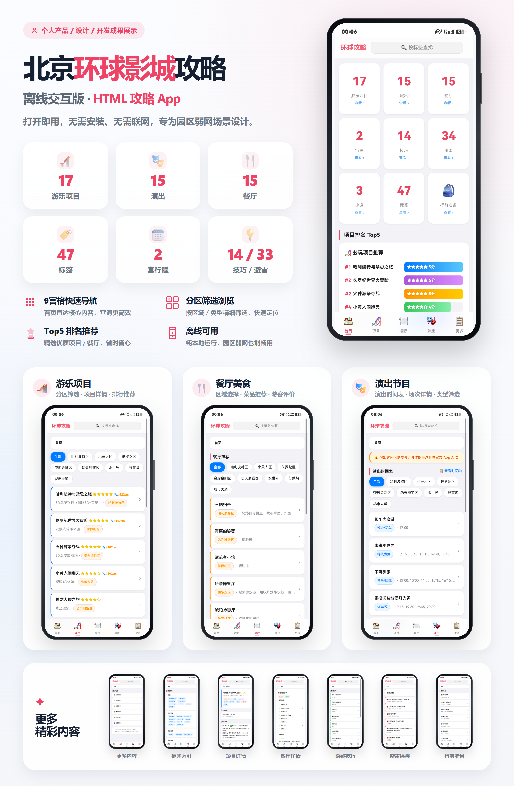

# AI 驱动的离线攻略生成器

> **一句话介绍：** 把碎片化的非结构化素材（笔记、截图、口述）丢给 AI，自动炼制成一个可交互的离线 HTML 攻略页面——无需联网、无需服务器、打开即用。

**在线预览：** [https://zlzayn.github.io/ai-batch-raw-to-offline-guide/](https://zlzayn.github.io/ai-batch-raw-to-offline-guide/)



---

## 这是什么

去香港迪士尼、珠海长隆时被信号差折磨后做的工具：把项目排名、餐厅评价、隐藏技巧全部结构化，生成单文件离线网页，带着进园区亲测好用。

后来发现这套数据结构不限于游乐园——换一套数据，上海迪士尼、成都美食地图、个人影单都能用。于是改造成了 **AI 驱动的生成流水线**：你提供素材、告诉 AI 想做什么，一个可交互的离线网页就自动生成了。

**核心亮点：**
- **单文件离线** — 一个 HTML 带走全部攻略，无需网络、无需安装、无需服务器
- **全域双向链接** — 看任何详情页，关联的项目/演出/餐厅/技巧/避雷一键跳转
- **正反方观点并排** — 同时展示优点和缺点的真实评价
- **动态轮播刷新** — 切回页面时技巧/避雷/菜品随机刷新
- **标签跨类型聚合** — 点一个标签搜出全部相关内容

**使用场景：** 园区内无信号查阅、出发前规划路线、排队里看技巧、选餐厅避雷、纠结玩哪个。

---

## 快速开始

### 方式一：直接打开（已有生成产物）

如果你已经拿到了 `output/guide.html`（或根目录的 `index.html`）：

- **手机**：用微信/文件管理器打开，添加到桌面像 App 一样使用
- **电脑**：双击直接用浏览器打开
- **分享**：AirDrop、微信发送、网盘分享均可，对方打开就能用

### 方式二：从源码生成

> 注意：`output/` 目录被 `.gitignore` 排除，**clone 下来后默认没有生成产物**，需要手动生成。

```bash
# 1. 安装依赖（项目含 pyproject.toml + uv.lock，推荐 uv sync；或 pip install jinja2 openpyxl）
uv sync

# 2. 验证数据完整性
uv run python scripts/schema_validator.py

# 3. 生成攻略页面
uv run python generator/schema_generator.py

# 生成成功后，打开 output/guide.html 即可预览
```

### 方式三：GitHub Pages 在线访问

已配置 GitHub Actions 自动部署，访问上方的在线预览链接。

> ⚠️ **不推荐作为日常使用方式**——本项目定位就是**离线使用**：把 `output/guide.html` 下载到手机/电脑本地，无网络也能用。
> GitHub Pages 只是**项目展示用途**（在线预览、分享给别人先看效果），且 GitHub 在国内访问不稳定，线上加载反而比本地慢。

> 根目录的 `index.html` 是 `output/guide.html` 的副本，专门用于 GitHub Pages 托管（CI 自动生成）。

---

## 换主题教程

想改成**上海迪士尼攻略**、**成都美食地图**、**个人影单推荐**？不需要写代码，全程 AI 协作。

**[docs/usage.md](docs/usage.md)** — AI 驱动的「素材 → 交互式网页」生成流水线使用指南

教程包含：
- 三步上手流程
- AI 工作规范（可直接复制发给 AI）
- 三种使用场景（换主题 / 减实体 / 全新定制）
- Schema 定义与修改规则
- 数据验证与修复循环

---

## 开发者与维护者

动手前先读 [AGENTS.md](AGENTS.md)（命令、验证快照、待办、活跃坑）与 [docs/ARCHITECTURE.md](docs/ARCHITECTURE.md)（为什么）。

### 项目结构

```
ai-batch-raw-to-offline-guide/
│
├── schema.json                       ← Schema 定义（实体、字段、关系）
│
├── data/                             ← 结构化数据层（13 个 JSON）
│   ├── meta.json                     ← 项目元信息、源文件索引
│   ├── attractions.json              ← 游乐项目
│   ├── shows.json                    ← 演出
│   ├── restaurants.json              ← 餐厅
│   ├── dishes.json                   ← 菜品
│   ├── tips.json                     ← 技巧
│   ├── warnings.json                 ← 避雷
│   ├── shortcuts.json                ← 小道
│   ├── itineraries.json              ← 行程
│   ├── reviews.json                  ← 评价
│   ├── opinions.json                 ← 观点
│   ├── tags.json                     ← 标签（11 个分类）
│   └── preparations.json             ← 行前准备
│
├── generator/                        ← HTML 生成器（模板渲染链）
│   ├── schema_generator.py           ← Schema 驱动生成脚本
│   └── guide_template.html           ← 页面模板（可自定义）
│
├── scripts/                          ← 工具脚本（校验与分析）
│   ├── schema_validator.py           ← Schema 驱动数据验证
│   ├── analyze_data.py               ← 数据结构分析（图表 + JSON 报告）
│   ├── export_xlsx.py                ← 导出 Excel
│   └── stats.py                      ← 数据统计
│
├── output/                           ← 生成产物（被 .gitignore 排除，需手动生成）
│   ├── guide.html                    ← 攻略主页（单文件离线版）
│   ├── data.xlsx                     ← Excel 导出
│   └── data_analysis/                ← 数据分析图表
│
├── projects/                         ← 其他主题项目（示例/测试）
│   └── 上海迪士尼攻略/               ← 上海迪士尼数据（换主题验证用例）
├── docs/                             ← 项目文档
│   ├── ARCHITECTURE.md               ← 架构设计：设计哲学、关键决策、数据流、契约
│   ├── schema-fields.md              ← Schema 字段手册（字段清单 + 引用关系 + 影响路由）
│   ├── usage.md                      ← AI 使用教程（换主题全流程指南）
│   ├── design.md                     ← 产品设计：信息架构、视觉规范
│   └── workflow.md                   ← 技术实现：生成流水线、索引算法
│
├── src/                              ← 原始素材（Markdown 笔记，仅供参考）
├── images/                           ← 截图素材
├── index.html                        ← GitHub Pages 入口（output/guide.html 的副本）
├── preview-hd.png                    ← 项目预览图
├── tools/screenshot/                 ← Node 截图工具（package.json + screenshot.js）
├── LICENSE
├── .github/workflows/static.yml      ← GitHub Actions 自动部署配置
├── VERIFICATION_REPORT.md            ← Schema 系统验证报告
├── changelog.md                      ← 变更日志
└── README.md                         ← 本文件
```

### 常用命令（uv 环境）

```bash
# 验证数据完整性（基于 Schema）—— 改 schema/data 后必跑
uv run python scripts/schema_validator.py

# 生成 HTML（Schema 驱动）
uv run python generator/schema_generator.py

# 导出 Excel
uv run python scripts/export_xlsx.py

# 数据结构分析（生成图表到 output/data_analysis/）
uv run python scripts/analyze_data.py

# 数据统计
uv run python scripts/stats.py

# 数据规范冒烟测试
uv run pytest
```

**依赖：** Python 3.12+、项目含 pyproject.toml + uv.lock（推荐 `uv sync` 安装；或 `pip install jinja2 openpyxl`）

### 文档索引

| 文档 | 路径 | 内容 | 适合谁看 |
|------|------|------|---------|
| **架构设计** | `docs/ARCHITECTURE.md` | 设计哲学、关键决策、数据流、契约 | 改架构/理解为什么时参考 |
| **Schema 字段手册** | `docs/schema-fields.md` | 13 实体字段清单、引用关系、改字段影响路由 | 改 Schema/数据时参考 |
| **AI 使用教程** | `docs/usage.md` | 换主题全流程、AI 工作规范、验证修复指南 | 想用 AI 生成新主题的人 |
| **产品设计** | `docs/design.md` | 信息架构、数据关联关系、视觉设计规范 | AI 改样式时参考 |
| **技术实现** | `docs/workflow.md` | 生成流水线、索引算法、前端路由/筛选/轮播 | AI 改功能时参考 |
| **验证报告** | `VERIFICATION_REPORT.md` | Schema 系统验证方法、测试结果 | 关注可靠性的人 |
| **变更日志** | `changelog.md` | Schema 版本演进、数据结构变更历史 | 关注历史的人 |

### 技术栈

- **Schema 层**：JSON Schema（声明式数据结构定义）
- **数据层**：JSON 文件（按实体类型组织）
- **验证层**：Python Schema 验证器（引用完整性、双向一致性）+ pytest 冒烟
- **生成层**：Python + Jinja2（Schema 驱动模板渲染）
- **展示层**：原生 HTML/CSS/JS（单文件离线、零依赖）
- **部署层**：GitHub Actions → GitHub Pages

---

> 全栈独立开发：一个人负责从项目架构、数据设计、前端交互到 AI 生成流水线的全部设计与实现。