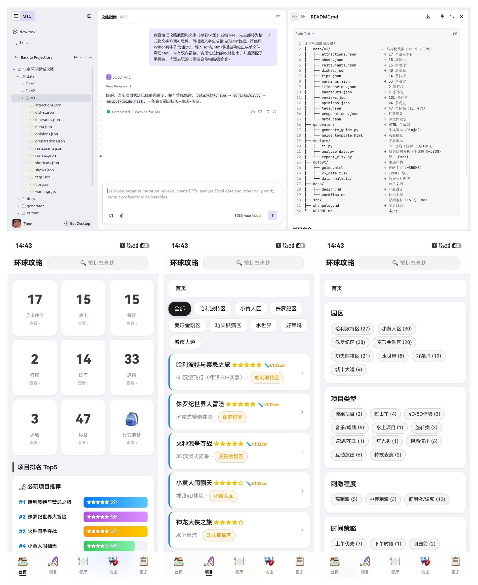

# 北京环球影城离线攻略 H5

> **AI 驱动的结构化数据流水线** — 从非结构化素材到严格 Schema 的 JSON，再到一键生成的离线 App。



---

## 这个项目是什么

一个手机端离线攻略应用。最终产物只有一个 `guide.html` 文件（~350KB），微信发给别人，对方在园区没网也能打开用。

但这个项目真正有意思的不是产物本身，而是**产物的生产方式**：

```
非结构化信息（截图/文字/备忘录）
    ↓ AI 驱动：理解、提取、结构化
半结构化 Markdown（16 份主题文档）
    ↓ AI 驱动：按 Schema 规范转换
超结构化 JSON（14 个文件，严格字段约束）
    ↓ Python 一键生成
离线 H5 应用（双向索引 + 23 路由 SPA）
```

核心设计在于中间那层 JSON Schema——它既是对 AI 输出的约束契约，也是 HTML 模板渲染的数据源。**Schema 设计好了，上游 AI 知道该怎么写，下游模板知道该怎么读。**

---

## 第一层：原始素材 → 结构化 Markdown

### 数据从哪来？

原始素材是**完全非结构化的**：

| 来源 | 格式 | 示例 |
|------|------|------|
| 微信备忘录截图 | 图片 | 手写的项目评价、排名、餐饮避雷 |
| 小红书截图 | 图片 | 9 家餐厅实测、行前准备清单 |
| 文本文档 / 口述笔记 | 纯文本 | 排队技巧、交通指南、存包策略 |

散落各处，格式不统一，有图片有文字，有重复有矛盾。

### AI 做了什么

1. **识别与理解**——OCR 识别截图文字，理解上下文语义
2. **去重与融合**——同一项目在不同素材中被多次提到，合并去重
3. **矛盾判断**——不同来源说法不一致时，保留为"对立观点"
4. **输出为 Markdown**——按主题分文件，人可读、机器也可读

产出是 `src/` 目录下的 **16 份 Markdown**：

```
src/
├── 00_总索引.md              # 全局入口
├── 01_行前准备/              # 交通、穿衣、必带物品...
├── 02_入园策略/              # 安检技巧、入园时间...
├── 03_园区导航/秘密小道.md   # 三条捷径路线
├── 04_项目攻略/              # 7 个园区各一份 + 总评排名
├── 05_餐饮美食/              # 餐厅推荐与菜品评价
├── 06_演出时间/              # 演出时间表
├── 07_行程安排/              # 一日游行程
├── 08_隐藏技巧/              # 14 条隐藏技巧
├── 09_避雷提醒/              # 33 条避雷
└── 10_小红书补充/            # 餐饮与行前补充（2 份）
```

---

## 第二层：Markdown → 严格 Schema 的 JSON（★ 核心设计）

Markdown 是给人看的。要让程序能处理、能索引、能交叉引用，需要更严格的格式。

这套 JSON Schema 是整个项目的**灵魂**：
- 对上游 AI → **输出规范**，必须按这个格式填数据
- 对下游模板 → **输入契约**，模板按这个格式取数据渲染
- 对 CI → **校验标准**，不符合规范的直接报错

### Schema 四大原则

#### 1. 一切皆 ID 引用，杜绝文本内嵌

```json
// ❌ v1 做法：餐厅里写字符串菜名
{ "name": "三把扫帚", "recommended_dishes": ["烤鸡排骨拼盘", "Butterbeer"] }

// ✅ v3 做法：只存 ID，去 dishes.json 查详情
{
  "id": "rest_three_broomsticks",
  "recommended_dish_ids": ["dish_roast_chicken_ribs", "dish_butterbeer"],
  "review_ids": ["review_rest_01"],
  "warning_ids": ["warn_food_03"],
  "zone_ids": ["zone_harry_potter"],
  "tags": ["zone_harry_potter", "restaurant_type_sit_down", "taste_british"]
}
```

数据只存在一个地方（Single Source of Truth），修改菜品名只需改 `dishes.json` 一处。

#### 2. 统一命名，消灭同义异名

| 字段 | 说明 |
|------|------|
| `zone_ids: string[]` | 园区归属统一为数组（即使只有一个） |
| `tags: string[]` | 统一字段名（不再有 `taste_tags` 这种特例） |
| `{type}_ids: string[]` | 所有跨实体引用统一为数组模式 |

#### 3. ID 命名即自描述

```
attr_harry_potter    → attraction, 哈利波特相关
rest_three_broomsticks → restaurant, 三把扫帚
dish_butterbeer      → dish, 黄油啤酒
tip_toilet_card      → tip, 厕所卡技巧
warn_queue_long      → warning, 排队久避雷
tag_zone_hp          → tag, 哈利波特区园区标签
```

前缀表明类型，后缀表明内容。

#### 4. 客观字段统一类型

```json
"price": { "value": 68, "note": "元起" }     // 价格：object
"duration_minutes": 120                         // 时长：number
"indoor": true, "water_splash": false           // 布尔：bool
```

### 最终数据资产：14 个 JSON，12 种实体

| 文件 | 数量 | 角色 |
|------|------|------|
| `meta.json` | 1 | 元数据：园区信息、版本号、来源文件索引 |
| `tags.json` | 47（11 分类） | **全局标签字典**，所有实体的 tags 引用它 |
| `attractions.json` | 17 | 游乐项目 |
| `shows.json` | 15 | 演出 |
| `restaurants.json` | 15 | 餐厅 |
| `dishes.json` | 40 | 菜品 |
| `tips.json` | 14 | 隐藏技巧 |
| `warnings.json` | 33 | 避雷提醒 |
| `reviews.json` | 101 | 评价（被实体通过 review_ids 引用） |
| `opinions.json` | 24 | 正反方对立观点 |
| `preparations.json` | 8 模块 | 行前准备 |
| `shortcuts.json` | 3 | 秘密小道 |
| `itineraries.json` | 2 | 行程方案 |

**全部通过 ID 互相引用，无文本内嵌。**

---

## 第三层：JSON → Python 一键生成 H5

### 生成器做了什么

`generate_guide.py` 读入 14 个 JSON，完成三步变换后注入模板：

```
Step 1: 构建 ID→对象 Map     → 前端 find(id, type) O(1) 查找
Step 2: 构建四套双向索引     → tag / zone / backrefs / alternative
Step 3: 序列化 + Jinja2 注入  → DATA + INDEXES 内嵌到 <script>
                              → 输出 guide.html
```

### 双向索引——从扁平数据到网状关联

普通攻略的页面之间是隔离的。本项目的索引让任何两个实体都能建立连接——这些关联**不是手写硬编码的，是 Python 从 JSON 的 ID 引用关系中自动计算出来的**：

| 用户在看 | 底部自动展示 | 数据来源 |
|----------|-------------|----------|
| "哈利波特禁忌之旅" | 相关技巧、相关避雷、同园区推荐、替代选择 | backrefs + zone_index + alternative_index |
| "某条餐饮避雷" | 影响的餐厅/菜品、推荐替代 | warning 自身的 IDs + alternatives |
| "高刺激"标签页 | 所有打了该标签的项目/演出/餐厅/菜品 | tag_index |

只要 JSON 符合 Schema 规范，索引就一定正确。

---

## 第四层：用户体验

### 产品形态

```
┌─────────────────────────────┐
│  环球攻略        [按标签查找] │  毛玻璃顶栏（固定）
├─────────────────────────────┤
│  首页 / 项目 / 禁忌之旅      │  面包屑（可回退）
├─────────────────────────────┤
│                             │
│     Hash 路由切换，无刷新      │
│                             │
├─────────────────────────────┤
│ 首页  项目  餐厅  演出  更多  │  毛玻璃底栏（5 Tab）
└─────────────────────────────┘
```

### 用户怎么用

1. **打开即用**——微信收到文件点开就能用，不装 App
2. **30 秒掌握全局**——首页 9 宫格 + Top5 排名 + 自动轮播
3. **按园区筛选**——只想看哈利波特区？点一下按钮
4. **详情页深挖**——排队策略、存包指南、真实评价、正反观点
5. **发现关联**——看完项目详情，底部自动展示相关技巧/避雷/替代
6. **完全离线**——园区没网？已全量加载

对标 iOS 原生体验：SF Pro 字体、系统灰背景、毛玻璃导航、按压反馈、安全区适配、8 种实体主题色。

---

## 扩展性：新增内容只需两步

整个架构让所有新内容都走同一条流水线：

1. 在对应 JSON 中按 Schema 新增记录（确保引用的是已有的 tag ID）
2. 跑 `python scripts/ci.py`

CI 自动校验 → 生成 HTML → 验证产物。**HTML 模板不需要改任何代码**——模板是通用的、数据驱动的。

这意味着：
- **AI 继续驱动**——新素材来了，AI 按 Schema 生成 JSON，跑 CI，完事
- **人工也能改**——JSON 是纯文本，任何人都能直接编辑
- **质量有保障**——CI 会检查 ID 唯一性、引用完整性、字段类型
- **Schema 是护城河**——Schema 设计好，上游输出和下游渲染都不会出错

---

## 技术参数一览

| 属性 | 值 |
|------|-----|
| 产物 | 单 HTML 文件，~350KB，零外部依赖 |
| 数据 | 12 类实体，~300+ 条，47 标签 11 分类 |
| 关系 | 全部 ID 引用，无文本内嵌 |
| 索引 | 4 套双向索引（构建时预计算） |
| 前端 | 23 路由 SPA，Vanilla JS 零依赖 |
| 构建 | Python + Jinja2，CI 三阶段管线 |
| 版本 | v3（v1→v2→v3 三次 Schema 迭代） |
